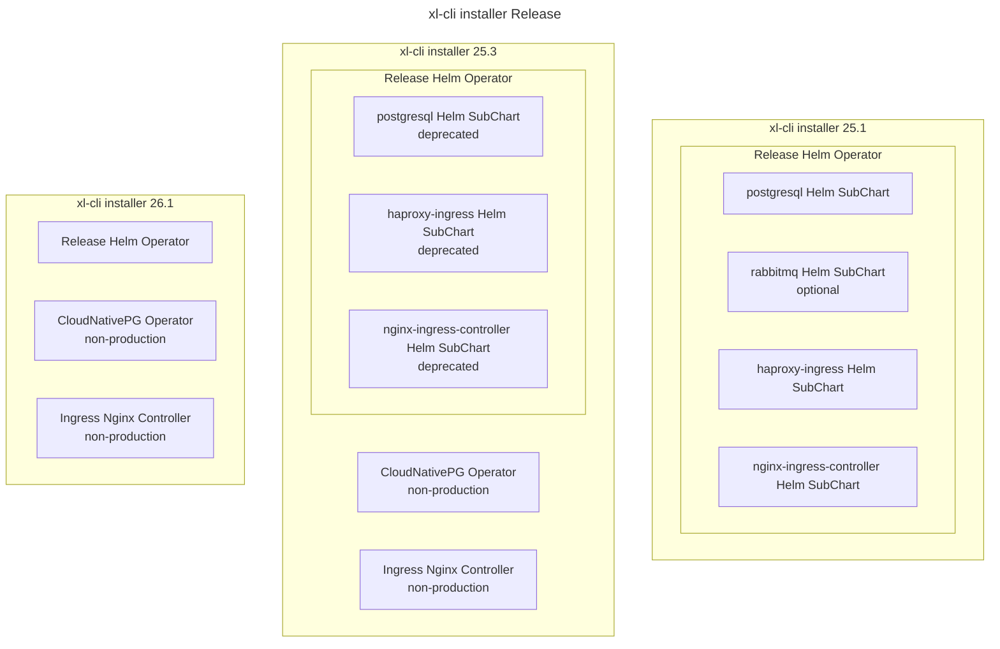
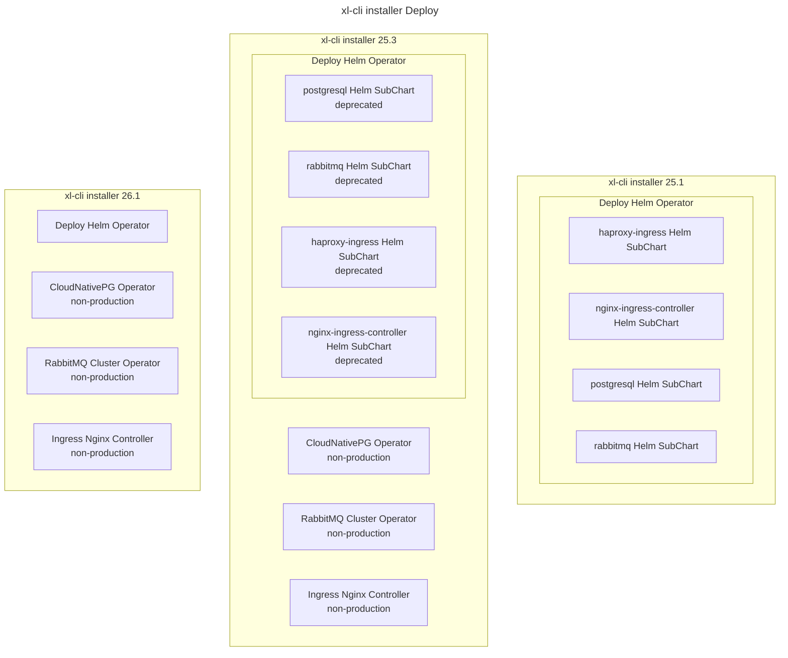

# operators-upgrade-blueprint
## Blueprint for operator to operator upgrade
## Blueprint for helm to operator upgrade

## Release Installation Changes 25+ 

```mermaid
---
title: xl-cli installer Release
---
graph TD
    subgraph "xl-cli installer 25.1"
        direction LR
        
        subgraph O1["Release Helm Operator"]
            direction LR
            E1[postgresql Helm SubChart]
            F1[rabbitmq Helm SubChart\noptional]
            C1[haproxy-ingress Helm SubChart]
            D1[nginx-ingress-controller Helm SubChart]
        end
    end
    subgraph "xl-cli installer 25.3"
        direction LR

        subgraph O2["Release Helm Operator"]
            direction LR
            E2[postgresql Helm SubChart\ndeprecated]
            C2[haproxy-ingress Helm SubChart\ndeprecated]
            D2[nginx-ingress-controller Helm SubChart\ndeprecated]
        end

        P2[CloudNativePG Operator\nnon-production]
        N2[Ingress Nginx Controller\nnon-production]
    end
    subgraph "xl-cli installer 26.1"
        direction LR
        
        O3["Release Helm Operator"]
        P3[CloudNativePG Operator\nnon-production]
        N3["Ingress Nginx Controller\nnon-production"]
    end
```

## Deploy

```mermaid
---
title: xl-cli installer Deploy
---
graph TD
    subgraph "xl-cli installer 25.1"
        direction LR
        
        subgraph O1["Deploy Helm Operator"]
            direction LR
            C1[haproxy-ingress Helm SubChart]
            D1[nginx-ingress-controller Helm SubChart]
            E1[postgresql Helm SubChart]
            F1[rabbitmq Helm SubChart]
        end
    end
    subgraph "xl-cli installer 25.3"
        direction LR

        subgraph O2["Deploy Helm Operator"]
            direction LR
            E2[postgresql Helm SubChart\ndeprecated]
            F2[rabbitmq Helm SubChart\ndeprecated]
            C2[haproxy-ingress Helm SubChart\ndeprecated]
            D2[nginx-ingress-controller Helm SubChart\ndeprecated]
        end

        P2[CloudNativePG Operator\nnon-production]
        R2[RabbitMQ Cluster Operator\nnon-production]
        N2[Ingress Nginx Controller\nnon-production]
    end
    subgraph "xl-cli installer 26.1"
        direction LR
        
        O3["Deploy Helm Operator"]
        P3[CloudNativePG Operator\nnon-production]
        R3[RabbitMQ Cluster Operator\nnon-production]
        N3["Ingress Nginx Controller\nnon-production"]
    end
```
