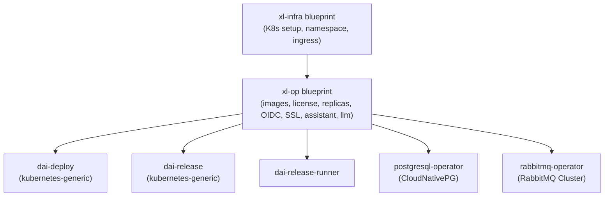
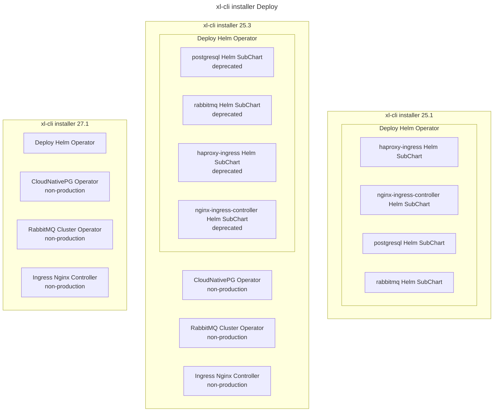

# XL CLI Installer Blueprints

This repository produces the XL CLI (`xl-cli`) installer blueprints used to install
and upgrade **Digital.ai Deploy**, **Digital.ai Release**, and the supporting
infrastructure operators (CloudNativePG, RabbitMQ Cluster, ingress) on Kubernetes
clusters. It supersedes the original *operators-upgrade-blueprint* scope and now
covers both fresh installs and upgrades, including the **Helm → Operator**
migration and the **Operator → Operator** upgrade paths.

The build pipeline packages everything into a single
`xl-op-blueprints-<version>.zip` artefact that `xl-cli` consumes directly.

---

## Features

- Supports single-node, on-prem multi-node, AWS EKS, Azure AKS, Google GKE, and
  OpenShift Kubernetes clusters.
- Installs / upgrades **Digital.ai Deploy** and **Digital.ai Release** via their
  respective Kubernetes operators.
- Provisions supporting infrastructure:
  - **CloudNativePG** operator + PostgreSQL cluster (non-production only)
  - **RabbitMQ Cluster** operator (non-production only)
  - **Ingress NGINX** controller (non-production)
  - OpenShift Routes (certified)
- Image registry selection: default public registries, custom public registry,
  or custom private registry with imagePullSecret.
- HTTPS keystore handling for the application server and ingress:
  auto-generated self-signed, file, editor (base64), or an existing Kubernetes
  Secret.
- OIDC integration: none, external OIDC provider, or Digital.ai Identity
  Service.
- Resource presets (`nano` … `2xlarge`) or a custom resource editor for CPU /
  memory requests and limits.
- License source: auto-generated evaluation, file, editor, or default internal
  repository keystore.
- **Digital.ai Release Assistant** and embedded **LLM Service** as optional
  subcharts of the Release operator — see the dedicated section below.

---

## Digital.ai Release Assistant & LLM Service

The blueprint optionally deploys the AI stack alongside Digital.ai Release. Two
Helm subcharts are wired into the `dai-release` CR template
(`xl-op/digitalai/dai-release/kubernetes-generic/dai-release_cr_default.yaml.tmpl`):

| Subchart                  | Image (default in `xl-op/override-defaults.yaml`)   | Purpose                                                                 |
| ------------------------- | --------------------------------------------------- | ----------------------------------------------------------------------- |
| `release-assistant-helm-chart` | `xebialabsunsupported/dai-release-assistant:26.3.0` | Digital.ai Release Assistant / Ask Release                              |
| `llm-service-helm-chart`  | `xebialabsunsupported/llm-service-api:0.0.1.284` (+ `llm-service-dbinit`) | Embedded LLM provider (OpenAI / Anthropic / …) with configurable JSON   |

When the Assistant or LLM Service is installed, the blueprint automatically
provisions two databases on the target PostgreSQL instance:

- `dai-assistant-db` (user `dai-assistant`)
- `dai-llm-db` (user `dai-llm`)

This is handled by `502-postgresql-init-secret.yaml` and
`503-postgresql-cluster.yaml.tmpl` under the Release sub-blueprint. The
PostgreSQL source can be:

- `chart` — the in-cluster PostgreSQL subchart,
- `operator` — CloudNativePG (`dai-xlr-postgres-rw`),
- `external` — an external PostgreSQL, configured via
  `PostgresqlExternalConfigReleaseAssistantUrl / Username / Password` and
  `PostgresqlExternalConfigLlmServiceUrl / Username / Password`.

### Use Case 1 — Fresh k8s install of Release + Assistant + LLM (operator)

A new installation on Kubernetes via the operator, including Release, Release
Assistant, and the embedded LLM Service in a single deploy.

Flow:

- `ProcessType = install`
- `ServerType = dai-release`
- `ReleaseAssistantInstall = true`
- `ReleaseAssistantLlmServiceInstall = true`
- Optional ingress for the Assistant (`ReleaseAssistantIngressEnabled = true`,
  `ReleaseAssistantIngressHostname`, `ReleaseAssistantIngressTlsEnabled`,
  `ReleaseAssistantIngressClassName`).
- OIDC for the Assistant: `ReleaseAssistantOidcIssuerUri`,
  `ReleaseAssistantOidcJwkSetUri`, `ReleaseAssistantOauth2TokenClientId`,
  `ReleaseAssistantOauth2TokenClientSecret`.
- LLM provider configuration via `ReleaseAssistantLlmServiceProviderConfig`
  (JSON, e.g. Anthropic, OpenAI) and optional
  `ReleaseAssistantLlmServiceSystemModelAliasMappings`.

### Use Case 2 — Upgrade existing k8s Release (operator) to include Assistant + LLM

An existing `dai-release` installation managed by the operator is upgraded and
the `release-assistant-helm-chart` and `llm-service-helm-chart` subcharts are
added to the same Release CR.

Flow:

- `ProcessType = upgrade` (set in `xl-infra`).
- `ReleaseAssistantInstall = true`.
- `ReleaseAssistantLlmServiceInstall = true` (optional — if `false`, supply an
  external LLM base URL via `ReleaseAssistantAiLlmBaseUrl`).
- Reuses the existing PostgreSQL instance (`chart`, `operator`, or `external`).
  The `dai-assistant-db` and `dai-llm-db` databases are created automatically
  during the upgrade.

---

## Repository Layout

```
.
├── xl-infra/                                    # K8s setup & ingress blueprint
├── xl-op/                                       # Main operator blueprint
│   ├── blueprint.yaml                           #   parameters, prompts, validation
│   ├── override-defaults.yaml                   #   pinned image / chart tags
│   └── digitalai/
│       ├── dai-deploy/kubernetes-generic/       # Deploy CR + helpers + templates
│       ├── dai-release/kubernetes-generic/      # Release CR (incl. assistant + llm) + templates
│       ├── dai-release-runner/                  # Release Runner install + SCC
│       ├── postgresql-operator/                 # CloudNativePG operator + cluster
│       └── rabbitmq-operator/                  # RabbitMQ Cluster operator
├── tests/
│   ├── answers/                                 # Golden answer files for blueprint tests
│   │   └── templates/apps/{deploy,release}/
│   └── e2e/                                     # End-to-end test scenarios
├── scripts/                                     # Trivy scan, image list, integ-test, answers
├── documentation/                               # Docusaurus sources (md, scripts/js)
├── docs/                                        # Generated static documentation site
├── build/                                       # Gradle output (charts, distributions zip)
├── Jenkinsfile                                  # CI: build + vulnerability scan
├── index.json                                   # Ordered list of blueprint directories
├── settings.gradle.kts
├── build.gradle.kts                             # Gradle build script
└── gradle.properties                            # Version + plugin pins
```

---

## Supported Platforms

The `K8sSetup` parameter in `xl-infra/blueprint.yaml` accepts the following
values:

| Value                  | Description                                                         |
| ---------------------- | ------------------------------------------------------------------- |
| `Openshift`            | Red Hat OpenShift — uses native Routes and SCCs.                    |
| `OpenshiftCertified`   | OpenShift with the certified-operators install path.                |
| `AWSEKS`               | Amazon Elastic Kubernetes Service.                                  |
| `AzureAKS`             | Microsoft Azure Kubernetes Service.                                 |
| `GoogleGKE`            | Google Kubernetes Engine.                                           |
| `PlainK8s`             | Generic multi-node or single-node Kubernetes cluster.               |

---

## Blueprint Architecture



`xl-cli` walks `index.json` to load the blueprints in order: `xl-infra`
provides cluster-level configuration first, then `xl-op` composes the
application and infrastructure sub-blueprints based on the selected `ServerType`
and feature flags.

---

## Release Installation Changes 25+

```mermaid
---
title: xl-cli installer Release
---
graph TD
    subgraph "xl-cli installer 25.1"
        direction LR

        subgraph O1["Release Helm Operator"]
            direction LR
            E1[postgresql Helm SubChart]
            F1[rabbitmq Helm SubChart\noptional]
            C1[haproxy-ingress Helm SubChart]
            D1[nginx-ingress-controller Helm SubChart]
        end
    end
    subgraph "xl-cli installer 25.3"
        direction LR

        subgraph O2["Release Helm Operator"]
            direction LR
            E2[postgresql Helm SubChart\ndeprecated]
            C2[haproxy-ingress Helm SubChart\ndeprecated]
            D2[nginx-ingress-controller Helm SubChart\ndeprecated]
        end

        P2[CloudNativePG Operator\nnon-production]
        N2[Ingress Nginx Controller\nnon-production]
    end
    subgraph "xl-cli installer 27.1"
        direction LR

        O3["Release Helm Operator"]
        P3[CloudNativePG Operator\nnon-production]
        N3["Ingress Nginx Controller\nnon-production]
    end
```

## Deploy



---

## Build & Run

### Prerequisites

- **JDK 21** (the build pins `languageLevel=21`)
- **Node 20** + **Yarn 1.22** (used for Docusaurus documentation generation)
- The `installHelm` Gradle task downloads Helm 4.2 automatically on first build.

### Key Gradle tasks

| Command                                                | Purpose                                                                                 |
| ------------------------------------------------------ | --------------------------------------------------------------------------------------- |
| `./gradlew build` / `./gradlew buildBlueprints`        | Build everything and produce `build/distributions/xl-op-blueprints-<version>.zip`.     |
| `./gradlew blueprintsArchives`                         | Only build the blueprints archive.                                                       |
| `./gradlew updateDocs`                                 | Generate Docusaurus site into `docs/`.                                                  |
| `./gradlew yarnRunStart`                               | Run the Docusaurus dev server locally.                                                  |
| `./gradlew uploadArchives`                             | Publish the archive to the configured Nexus repository.                                 |
| `./gradlew syncToDistServer -PversionToSync=<version>`  | Rsync a published archive to the public distribution server (`dist.xebialabs.com`).     |

Snapshot versions are produced with a timestamp suffix
(`<version>-<Mdd.Hmm>`) unless `RELEASE_EXPLICIT` is set in the environment.

---

## Testing

The repository ships two complementary test layers:

- **`tests/answers/`** — Golden answer files that exercise blueprint prompts.
  These are used to generate reproducible install / upgrade / clean scenarios for
  both Deploy and Release.
- **`tests/e2e/`** — End-to-end Kubernetes scenarios (single-node, multi-pod,
  external DB / MQ, etc.) driven through `xl-cli` against real clusters.

Helper scripts in `scripts/` (e.g. `generate_answers.sh`,
`image-operator-list.sh`, `integtest-chart-docker.sh`) are used to regenerate
answers and run integration tests.

---

## Documentation

- `documentation/` — Docusaurus source (markdown, JS scripts, sidebar config).
- `docs/` — Generated static site, produced by the `updateDocs` task which
  wires `yarnRunBuild` → `GenerateDocumentation`.

To work on the documentation locally:

```
./gradlew yarnInstallJsScripts
./gradlew yarnRunStart
```

---

## CI/CD

`Jenkinsfile` defines two stages:

1. **Build Kube Blueprints** — `clean uploadArchives devSnapshot` (with docs
   and tests skipped) → archive `build/distributions/xl-op-blueprints-*.zip`.
2. **Scan Vulnerabilities** — `./scripts/image-operator-list.sh |
   ./scripts/scan-with-trivy.sh operator-<branch>` → archive Trivy reports.

Slack notifications on the `team-apollo-internal` channel report success /
failure.

---

## Release & Distribution

- **Artifact** — `xl-op-blueprints-<version>.zip`, published to the configured
  Nexus repository under
  `ai/digital/xlclient/blueprints/xl-op-blueprints/<version>/`.
- **Distribution** — Public download via `dist.xebialabs.com`, replicated by
  `syncBlueprintsArchives` / `syncToDistServer`.
- **Snapshots** — Locally the archive can be installed via
  `./publish_local_https.sh`; HTTPS publishes use `./publish_https.sh`.

---

## Versioning

- The base version lives in `gradle.properties` (`version=27.1.0`).
- Image / chart tag pins live in `xl-op/override-defaults.yaml` (Deploy,
  Release, Release Assistant, LLM Service, CloudNativePG, RabbitMQ).
- CI uses the version reported by `Jenkinsfile#getCurrentVersion()` (currently
  `27.1.0`) and suffixes it with the branch name to produce a per-branch
  release identifier.

---

## Contributing

- Edit blueprints under `xl-infra/` and `xl-op/`.
- When adding or changing parameters, regenerate the answer files under
  `tests/answers/templates/` (`scripts/generate_answers.sh`) so the blueprint
  tests stay in sync.
- Run `./gradlew build` locally and ensure `tests/answers/` snapshots are
  updated before opening a pull request.